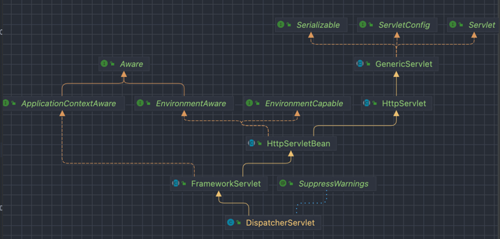

# spring-mvc-core

----

#### 서블릿과 JSP 의 한계

- 서블릿으로 개발할 때는 뷰를 만드는 화면이 자바 코드에 섞여서 복잡하다.
- JSP 로 개발할 때는 JSP 가 너무 많은 역할을 갖는다.

#### MVC 패턴의 등장
- 비즈니스 로직은 서블릿 처럼 다른곳에서 처리하고, JSP 는 목적에 맞게 HTML에 집중한다.

##### WEB-INF 폴더
- 항상 서블릿을 거쳐서 호출한다는 약속된 폴더

---

## 프론트 컨트롤러 패턴

> 공통의 관심사를 처리하는 프로세스를 컨트롤러 앞 단에 두는 패턴

- 프론트 컨트롤러 서블릿 하나로 클라이언트의 요청을 다 받는다.
- 프론트 컨트롤러가 요청에 맞는 컨트롤러를 찾아서 호출한다.
- 입구를 하나로..
- 공통 처리가 쉬워진다.
- 프론트 컨트롤러를 제외한 나머지 컨트롤러는 서블릿에 대해 몰라도 된다.

<b> 스프링 웹 MVC 의 핵심은 DispatcherServlet 이며, DispatcherServlet 은 프론트 컨트롤러의 패턴으로 활용하여 구현되었다. </b>  

### 프론트 컨트롤러 도입 v1

1. 서블릿과 비슷한 모양의 컨트롤러 인터페이스를 도입
2. 매핑 정보를 가진 FrontControllerV1 을 만들고 그 안에서 다형성을 활용해 매핑해줬다.

### 프론트 컨트롤러 도입 v2

1. 뷰 렌더의 역할을 가진 객체를 생성했다.

### 프론트 컨트롤러 도입 v3
1. 컨트롤러 입장에서 필요없는 HttpServletRequest, HttpServletResponse 를 제거하고 Map 으로 파라미터를 받는다.
   - 뷰 렌더의 책임을 MyView 로 옮겼으므로 컨트롤러에서 request 와 response 를 사용하지 않는다.
2. 뷰 경로를 사용하는 중복 코드 제거
   - "/WEB-INF/views/members" 제거
3. modelView 생성

### 프론트 컨트롤러 도입 v4
- modelView 를 반환하지 않고 ViewName 만 반환한다.

---

## DispatcherServlet

> 프론트 컨트롤러 패턴으로 만들어진 스프링 프레임워크의 Servlet 이다. 부모 클래스에서 HttpServlet 을 상속 받고 있으며, 서블릿으로 동작한다.

  
[더 자세한 경로가 높은 우선순위를 가지기 때문에 기존에 등록한 서블릿도 함께 동작한다.]()

- 스프링 부트는 DispatcherServlet 을 서블릿으로 자동으로 등록하며 모든 경로 (urlPatterns="/") 에 대해서 매핑한다.

#### 요청 흐름
1. 서블릿이 호출되면 HttpServlet 에서 제공하는 service() 가 호출된다.
2. Spring MVC 는 DispatcherServlet 의 부모인 FrameworkServlet 에서 service () 오버라이드 해두었다.
3. FrameworkServlet.service() 를 시작으로 여러 메서드가 호출되면서 <b>DispatcherServlet.doDispatch() 가 호출된다.</b>

### DispatcherServlet.doDispatch()
> 핸들러에 대한 실제 디스패치를 처리합니다. 핸들러는 서블릿의 HandlerMappings 를 순서대로 적용하여 얻을 수 있습니다.   
> HandlerAdapter 는 핸들러 클래스를 지원하는 첫 번째 항목을 찾기 위해 서블릿에 설치된 HandlerAdapters 를 쿼리하여 얻을 수 있습니다.  
> 모든 HTTP 메소드는 이 메소드에 의해 처리됩니다. 어떤 메소드가 허용되는지 결정하는 것은 HandlerAdapter 또는 핸들러 자체에 달려 있습니다.  

- Params 
  - request – current HTTP request 
  - response – current HTTP response
- Throws:
  - Exception – in case of any kind of processing failure

```java
protected void doDispatch(HttpServletRequest request, HttpServletResponse
        response) throws Exception {
        HttpServletRequest processedRequest = request;
        HandlerExecutionChain mappedHandler = null;
        ModelAndView mv = null;
        
        // 1. 핸들러 조회
        mappedHandler = getHandler(processedRequest); if (mappedHandler == null) {
        noHandlerFound(processedRequest, response);
        return;
}
        //2.핸들러 어댑터 조회-핸들러를 처리할 수 있는 어댑터
        HandlerAdapter ha = getHandlerAdapter(mappedHandler.getHandler());
        // 3. 핸들러 어댑터 실행 -> 4. 핸들러 어댑터를 통해 핸들러 실행 -> 5. ModelAndView 반환 mv = ha.handle(processedRequest, response, mappedHandler.getHandler());
        processDispatchResult(processedRequest, response, mappedHandler, mv,
        dispatchException);
}
private void processDispatchResult(HttpServletRequest request,
        HttpServletResponse response, HandlerExecutionChain mappedHandler, ModelAndView
        mv, Exception exception) throws Exception {
        // 뷰 렌더링 호출
        render(mv, request, response);
}
protected void render(ModelAndView mv, HttpServletRequest request,
        HttpServletResponse response) throws Exception {
        View view;
        String viewName = mv.getViewName(); //6. 뷰 리졸버를 통해서 뷰 찾기,7.View 반환
        view = resolveViewName(viewName, mv.getModelInternal(), locale, request);
// 8. 뷰 렌더링
        view.render(mv.getModelInternal(), request, response);
}
```

#### 동작 순서
1. 핸들러 조회: 핸들러 매핑을 통해 요청 URL에 매핑된 핸들러(컨트롤러)를 조회한다.
2. 핸들러 어댑터 조회: 핸들러를 실행할 수 있는 핸들러 어댑터를 조회한다.
3. 핸들러 어댑터 실행: 핸들러 어댑터를 실행한다.
4. 핸들러 실행: 핸들러 어댑터가 실제 핸들러를 실행한다.
5. ModelAndView 반환: 핸들러 어댑터는 핸들러가 반환하는 정보를 ModelAndView로 변환해서 반환한다.
6. viewResolver 호출: 뷰 리졸버를 찾고 실행한다. 
   - JSP의 경우: InternalResourceViewResolver 가 자동 등록되고, 사용된다.
7. View반환: 뷰 리졸버는 뷰의 논리 이름을 물리 이름으로 바꾸고, 렌더링 역할을 담당하는 뷰 객체를 반환한다.
   - JSP의 경우 InternalResourceView(JstlView) 를 반환하는데, 내부에 forward() 로직이 있다.
8. 뷰 렌더링: 뷰를 통해서 뷰를 렌더링 한다.

--- 

## 핸들러 매핑과 핸들러 어댑터

### DispatcherServlet 의 조회 순서
1. 핸들러 매핑으로 핸들러 조회
   1. RequestMappingHandlerMapping (애노테이션 기반)
   2. BeanNameUrlHandlerMapping (스프링 빈 이름 기반)
2. 핸들러 어댑터 조회
   1. RequestMappingHandlerAdapter (애노테이션 기반의 컨트롤러 : @RequestMapping)
   2. HttpRequestHandlerAdapter (HttpRequestHandler) 처리
   3. SimpleControllerHandlerAdapter (org.springframework.web.servlet.mvc.Controller 인터페이스 처리) 
3. 핸들러 어댑터 실행

### OldSpringController
OldSpringController 에서 사용되는 객체는 (HandlerMapping) BeanNameUrlHandlerMapping 과 (HandlerAdapter) SimpleControllerHandlerAdapter 가 있다.

1. HandlerMapping 을 순서대로 실행해서 핸들러를 찾는다.
   - BeanNameUrlHandlerMapping 가 실행에 성공하고 해당 핸들러인 OldSpringController 를 반환
2. HandlerAdapter 의 supports() 를 순서대로 호출한다.
   - SimpleControllerHandlerAdapter 가 Controller 를 지원하므로 대상에 해당함
3. DispatcherServlet 이 조회한 SimpleControllerHandlerAdapter 를 실행하면서 핸들러 정보도 함께 넘겨준다.
   - SimpleControllerHandlerAdapter 는 핸들러인 OldSpringController 를 내부에서 실행하고, 그 결과를 반환


### MyHttpRequestHandler
MyHttpRequestHandler 에서 사용되는 객체는 (HandlerMapping) BeanNameUrlHandlerMapping 과 (HandlerAdapter) HttpRequestHandlerAdapter 가 있다.

---


## 뷰 리졸버

스프링 부트는 InternalResourceViewResolver 라는 뷰 리졸버를 자동으로 등록하는데, 이때 스프링 프로퍼티스 에 등록한 spring.mvc.view.prefix=/WEB-INF/views/, spring.mvc.view.suffix=.jsp 정보를 사용한다.

```java
@Bean
InternalResourceViewResolver internalResourceViewResolver() {
    return new InternalResourceViewResolver("/WEB-INF/views/", ".jsp");
}
```

- BeanNameViewResolver : 빈 이름으로 뷰를 찾아서 반환 (엑셀 등등)
- InternalResourceViewResolver : JSP 를 처리할 수 있는 뷰 반환

1. 핸들러 어댑터 호출
   - 핸들러 어댑터를 통해 new-form 이라는 논리 뷰 이름 획득
2. ViewResolver 호출
   - new-form 이라는 뷰 일므으로 viewResolver 를 순서대로 호출
   - BeanNameViewResolver 는 new-form 이라는 이름의 스프링 빈으로 등록된 뷰를 찾아야 하는데 없는 경우
   - InternalResourceViewResolver 가 호출
3. InternalResourceViewResolver
   - InternalResourceView 를 반환
4. 뷰 - InternalResourceView
   - JSP 처럼 포워드 (forward()) 를 호출해서 처리할 수 있는 경우 사용
5. view.render()
   - view.render() 가 호출되고 InternalResourceView 는 forward() 를 사용해 JSP 를 실행
